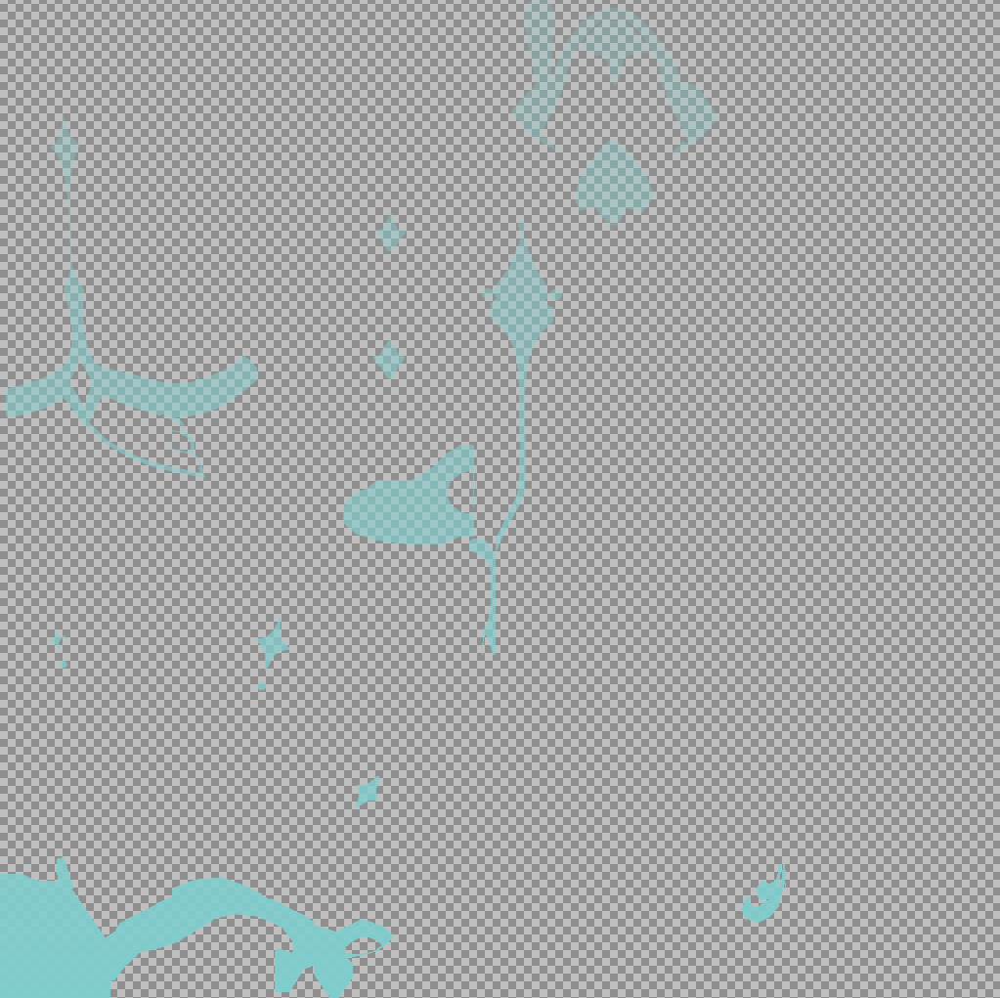

# GIGlow: 3dmigoto原神动态光效模组

## 参考GIMI的[特效修改教程](https://github.com/SilentNightSound/GI-Model-Importer/blob/main/Guides/CN_EffectModdingTutorial.md)
## 参考TexFX的[着色器写法](https://github.com/SinsOfSeven/TexFx)

## 效果
*  ### 常驻
https://github.com/user-attachments/assets/9d51d800-06a4-4df6-873a-48525c46373f
<!-- <div align="center"><video src="https://github.com/user-attachments/assets/9d51d800-06a4-4df6-873a-48525c46373f.mp4" autoplay="false" controls="controls" style="width: 500px"></video></div> -->

*  ### 渐隐
https://github.com/user-attachments/assets/1c8ace70-4de9-491b-a8a7-571796d9b699
<!-- <div align="center"><video src="https://github.com/user-attachments/assets/1c8ace70-4de9-491b-a8a7-571796d9b699" autoplay="false" controls="controls" style="width: 500px"></video></div> -->

*  ### 流动
https://github.com/user-attachments/assets/401eb60f-2f39-436d-b426-5e7a4aef9833
<!-- <div align="center"><video src="https://github.com/user-attachments/assets/401eb60f-2f39-436d-b426-5e7a4aef9833" autoplay="false" controls="controls" style="width: 500px"></video></div> -->

*  ### 变色
https://github.com/user-attachments/assets/6b23a51e-ac8c-4867-a945-2235ed24182f
<!-- <div align="center"><video src="https://github.com/user-attachments/assets/6b23a51e-ac8c-4867-a945-2235ed24182f" autoplay="false" controls="controls" style="width: 500px"></video></div> -->

## 使用方法

### 1. 下载GIGlow.ini，并放入Mods文件夹中

### 2. 找到想要修改的模组，以默认装扮的旅行者为例（案例模组由SSMT生成）
<div align="center"></div>

### 3. 找到想要修改纹理所在的漫反射贴图，并扣出修改部分
<div align="center"></div>

### 4. 新建图层，将扣出的修改部分粘贴到新图层上，删除旧图层，另存为新的DDS贴图，格式选择BC7(sRGB，DX 11+)，命名为glowcontrolmap.dds（任意名字即可）
<div align="center"></div>

### 5. 【可选】在新贴图中选中修改纹理，添加透明度渐变以获得“流动”效果（不透明度高的纹理先出现）
<div align="center"></div>

### 6. 打开mod的ini文件，添加以下配置
```ini
[Constants]
global $active = 0

[Present]
run = CommandList\GIGlow\Clear
post $active = 0

[TextureOverride_VB_e7612ed8__Position]
hash = 8239be13
vb0 = Resourcee7612ed8Position
$active = 1
```
`active`在`Position Override`处置`1`，表示角色是否在渲染画面里，用作控制GIGlow的开关
如果`active`变量已存在，则只需在`[Present]`中添加`run = CommandList\GIGlow\Clear`

### 7. 找到修改纹理对应的TextureOverride部分，在纹理覆写部分的最后添加以下内容
```ini
[TextureOverrideGlow]
;对应ib_hash
hash = e7612ed8
;对应起始索引
match_first_index = 6915
handling = skip
$\GIGlow\time = time
$\GIGlow\type = 2
$\GIGlow\enabled = $active
$\GIGlow\speed = 0.8
$\GIGlow\bright = 1.0
$\GIGlow\glow = -1.0
$\GIGlow\bloom = -1.0
ps-t80 = ResourceGlowControlMap
run = CommandList\GIGlow\Run
```
*  **修改前的整体`[TextureOverride]`**
```ini
;MARK:TextureOverrideIB----------------------------------------------------------
[TextureOverride_IB_e7612ed8__Component1]
hash = e7612ed8
match_first_index = 0
handling = skip
ib = Resource_e7612ed8_Component1
ps-t0 = Resource_e7612ed8_1_dae4b580_Slot_DiffuseMap
ps-t1 = Resource_e7612ed8_1_390f357b_Slot_LightMap
; [mesh:e7612ed8-1-Original] [vertex_count:1786]
drawindexed = 6915,0,0

[TextureOverride_IB_e7612ed8__Component2]
hash = e7612ed8
match_first_index = 6915
handling = skip
ib = Resource_e7612ed8_Component2
ps-t0 = Resource_e7612ed8_2_c4c881a9_Slot_DiffuseMap
ps-t1 = Resource_e7612ed8_2_d298f0bc_Slot_LightMap
; [mesh:e7612ed8-2-Original] [vertex_count:9678]
drawindexed = 33498,0,0

[TextureOverride_IB_e7612ed8__Component3]
hash = e7612ed8
match_first_index = 40413
handling = skip
ib = Resource_e7612ed8_Component3
ps-t0 = Resource_e7612ed8_3_c4c881a9_Slot_DiffuseMap
ps-t1 = Resource_e7612ed8_3_d298f0bc_Slot_LightMap
; [mesh:e7612ed8-3-Original] [vertex_count:973]
drawindexed = 3498,0,0
```
*  **修改后的整体`[TextureOverride]`**
```ini
;MARK:TextureOverrideIB----------------------------------------------------------
[TextureOverride_IB_e7612ed8__Component1]
hash = e7612ed8
match_first_index = 0
handling = skip
ib = Resource_e7612ed8_Component1
ps-t0 = Resource_e7612ed8_1_dae4b580_Slot_DiffuseMap
ps-t1 = Resource_e7612ed8_1_390f357b_Slot_LightMap
ps-t80 = null
; [mesh:e7612ed8-1-Original] [vertex_count:1786]
drawindexed = 6915,0,0

[TextureOverride_IB_e7612ed8__Component2]
hash = e7612ed8
match_first_index = 6915
handling = skip
ib = Resource_e7612ed8_Component2
ps-t0 = Resource_e7612ed8_2_c4c881a9_Slot_DiffuseMap
ps-t1 = Resource_e7612ed8_2_d298f0bc_Slot_LightMap
; [mesh:e7612ed8-2-Original] [vertex_count:9678]
drawindexed = 33498,0,0

[TextureOverride_IB_e7612ed8__Component3]
hash = e7612ed8
match_first_index = 40413
handling = skip
ib = Resource_e7612ed8_Component3
ps-t0 = Resource_e7612ed8_3_c4c881a9_Slot_DiffuseMap
ps-t1 = Resource_e7612ed8_3_d298f0bc_Slot_LightMap
ps-t80 = null
; [mesh:e7612ed8-3-Original] [vertex_count:973]
drawindexed = 3498,0,0

[TextureOverrideGlow]
;对应ib_hash
hash = e7612ed8
;对应起始索引
match_first_index = 6915
handling = skip
$\GIGlow\time = time
$\GIGlow\type = 2
$\GIGlow\enabled = $active
$\GIGlow\speed = 0.8
$\GIGlow\bright = 1.0
$\GIGlow\glow = -1.0
$\GIGlow\bloom = -1.0
ps-t80 = ResourceGlowControlMap
run = CommandList\GIGlow\Run
```
*  **注意，在无需修改的`[TextureOverride]`里面添加`ps-t80 = null`，以免出现bug**
*  **解释**
    * `time`为动态效果所需的时间变量
    * `type`为动态效果的类型变量，`0`为常驻效果，`1`为渐隐效果，`2`为流动效果，`3`为变色效果
    ***（流动效果的控制纹理需要设置透明度渐变）***
    * `enabled`为动态效果是否启用的变量，由角色是否在场控制
    * `speed`为动态效果的速度变量（大于`0`的`float`数值，不要太大）
    * 修改纹理处的贴图图案颜色由第4步中新建的控制贴图决定
    * `birght`对应控制贴图的透明度采样值（相当于漫反射贴图的透明度通道），控制发光亮度
    * `glow`对应着色器最终输出的`o1.w`，与`texfx t69`贴图的`green`通道效果相同
    * `bloom`对应着色器最终输出的`o4.x`，与`texfx t69`贴图的`blue`通道效果相同


### 8. 最后，在mod的ini文件里面添加资源引用
```ini
[ResourceGlowControlMap]
filename = path\to\your\glowcontrolmap.dds
```
`glowcontrolmap.dds`即第4步中新建的发光贴图

## 提示

*  `speed`、`bright`、`glow`、`bloom`设置的时候要带上小数点，例如`bright = 1.0`，不然可能由bug
*  `bright`、`glow`、`bloom`设置为`-1.0`时会在着色器里面使用默认值
*  `bright`和`glow`同时控制发光效果，建议仅设置其中一个，注意`glow`为`0.0`时修改纹理会呈现黑色
*  `bloom`可能控制光晕效果

## 存在问题

* 不清楚是否与`texfx`兼容
* 部分角色、部分衣服可能不生效（着色器逻辑不同未能捕获）
* 纳塔角色在夜魂状态下不生效（着色器逻辑不同未能捕获）

### *第一次尝试修改着色器，若有错误欢迎指正修改:D*
